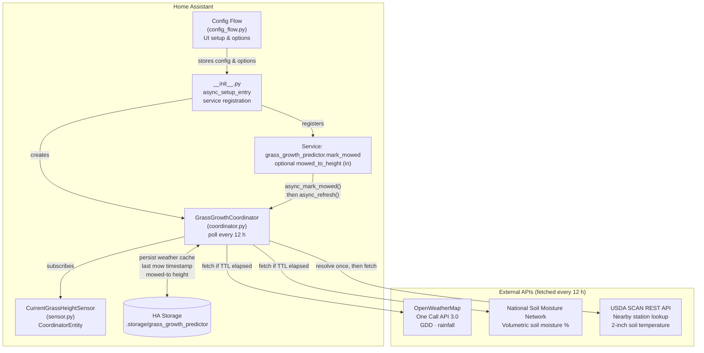
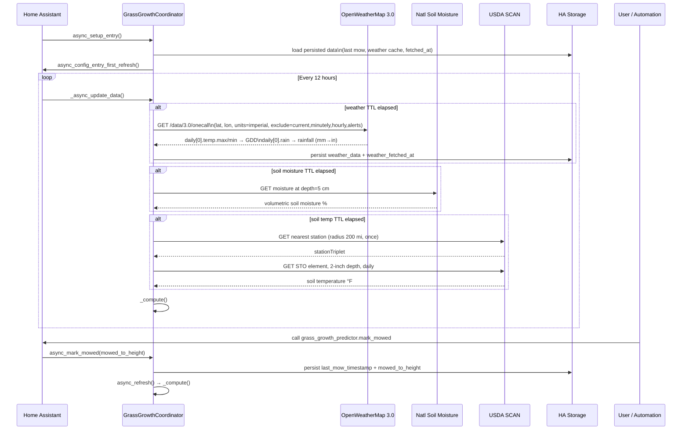
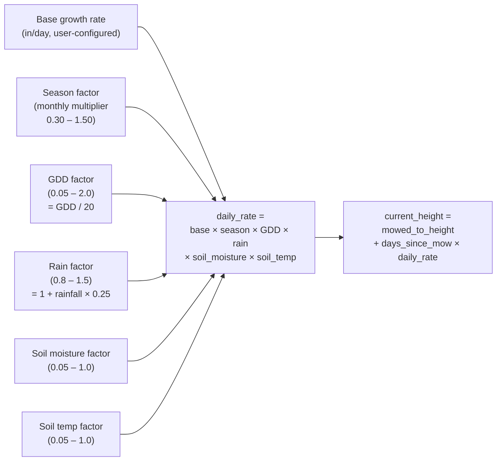

# Grass Growth Predictor — Architecture

→ [README](README.md) · [CHANGELOG](CHANGELOG.md)

## Overview

The integration estimates current grass height by accumulating a calculated daily growth rate over the time elapsed since the last mow. It is configured once via the UI config flow, runs a polling coordinator every 12 hours to refresh external data, and exposes **eight sensor entities** plus a `mark_mowed` service.

---

## Sensors

| Entity | Unit | Description |
|---|---|---|
| `sensor.current_grass_height` | in | Estimated current grass height |
| `sensor.daily_growth_rate` | in/day | Fully computed daily growth rate (all active factors applied) |
| `sensor.days_since_last_mow` | d | Fractional days elapsed since the last mow |
| `sensor.growing_degree_days` | °F·d | Today's GDD (avg temp − 50 °F base, floored at 0) |
| `sensor.rainfall` | in | Today's precipitation from OpenWeatherMap |
| `sensor.soil_moisture` | % | Volumetric soil moisture from National Soil Moisture Network |
| `sensor.soil_temperature` | °F | 2-inch soil temperature from the nearest USDA SCAN station |
| `sensor.season_factor` | *(dimensionless)* | Current month's seasonal growth multiplier (0.30 – 1.50) |

All sensors share the same **Grass Growth Predictor** device and update together on the 12-hour coordinator cycle.

---

## Component Diagram



---

## Data Flow



---

## Growth Model



Each multiplier can be individually **enabled or disabled** via integration options. Disabled factors default to `1.0` (no effect).

### Height Formula

```
current_height = mowed_to_height + days_since_mow × daily_rate

daily_rate = base_rate
           × season_factor   (0.30 – 1.50, by month)
           × gdd_factor      (0.05 – 2.0,  GDD / 20)
           × rain_factor     (0.80 – 1.50, 1 + rainfall_in × 0.25)
           × soil_moisture   (0.05 – 1.0,  piecewise by %)
           × soil_temp       (0.05 – 1.0,  piecewise by °F)
```

---

## Update Intervals

| Data source | Fetch interval | Notes |
|---|---|---|
| OpenWeatherMap One Call 3.0 (GDD + rainfall) | 12 hours | Cached to storage; survives HA restarts |
| National Soil Moisture Network (soil moisture %) | 12 hours | In-memory cache only |
| USDA SCAN (2-inch soil temperature) | 12 hours | Station triplet resolved once, then cached in memory |
| Height calculation (coordinator poll) | 12 hours | Pure computation — no network call |

---

## Persistence

| Key | What is stored |
|---|---|
| `last_mow_timestamp` | ISO timestamp of the most recent mow event |
| `mowed_to_height` | Height the grass was cut to (inches) |
| `weather_fetched_at` | ISO timestamp of last OWM fetch (prevents extra API calls on restart) |
| `weather_data` | Cached `{gdd, rainfall}` from the last successful OWM response |

All data is written to HA's built-in `.storage/` mechanism and survives restarts.

---

## Configuration Options

| Option | Description | Default |
|---|---|---|
| Latitude / Longitude | Location for all API lookups | HA location |
| OWM API Key | OpenWeatherMap One Call 3.0 key | — |
| Mowed to height | Starting height after a mow (in) | 3.0 in |
| Base growth rate | Daily growth rate ceiling (in/day) | 0.15 in/day |
| Enable seasonal | Apply monthly growth multiplier | ✓ |
| Enable GDD | Scale by growing degree days | ✓ |
| Enable rain | Scale by daily rainfall | ✓ |
| Enable soil moisture | Scale by volumetric soil moisture | ✓ |
| Enable soil temp | Scale by 2-inch soil temperature | ✓ |
