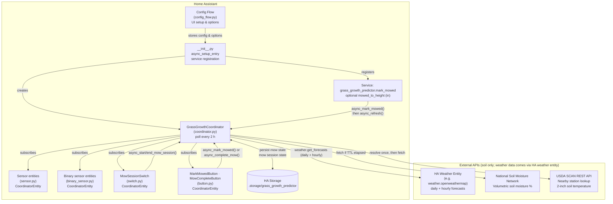
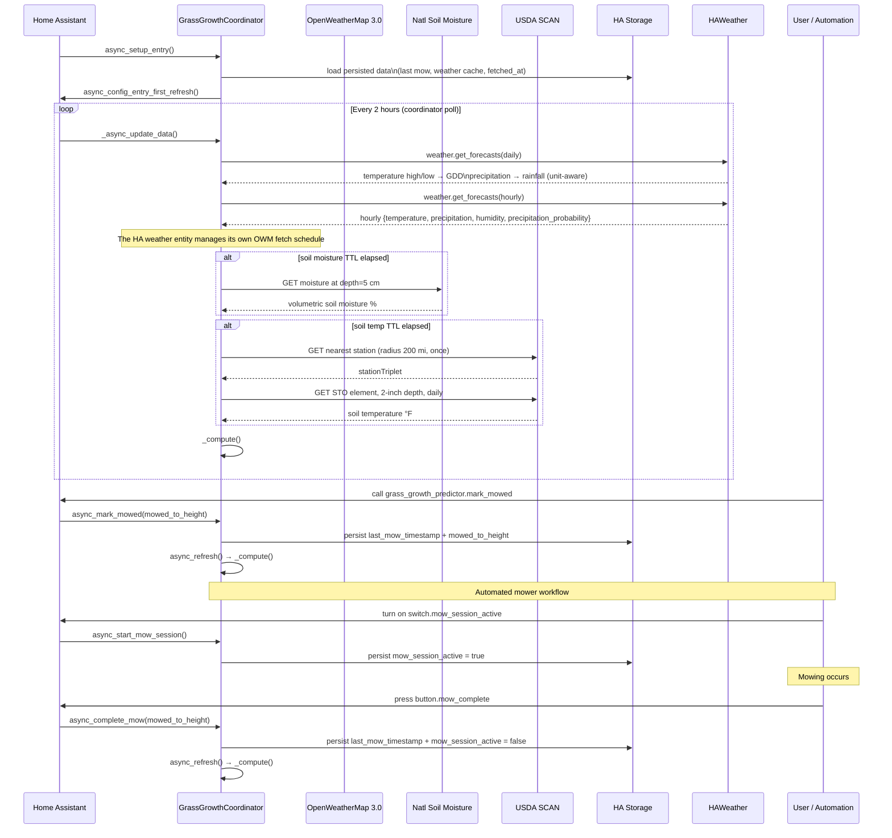
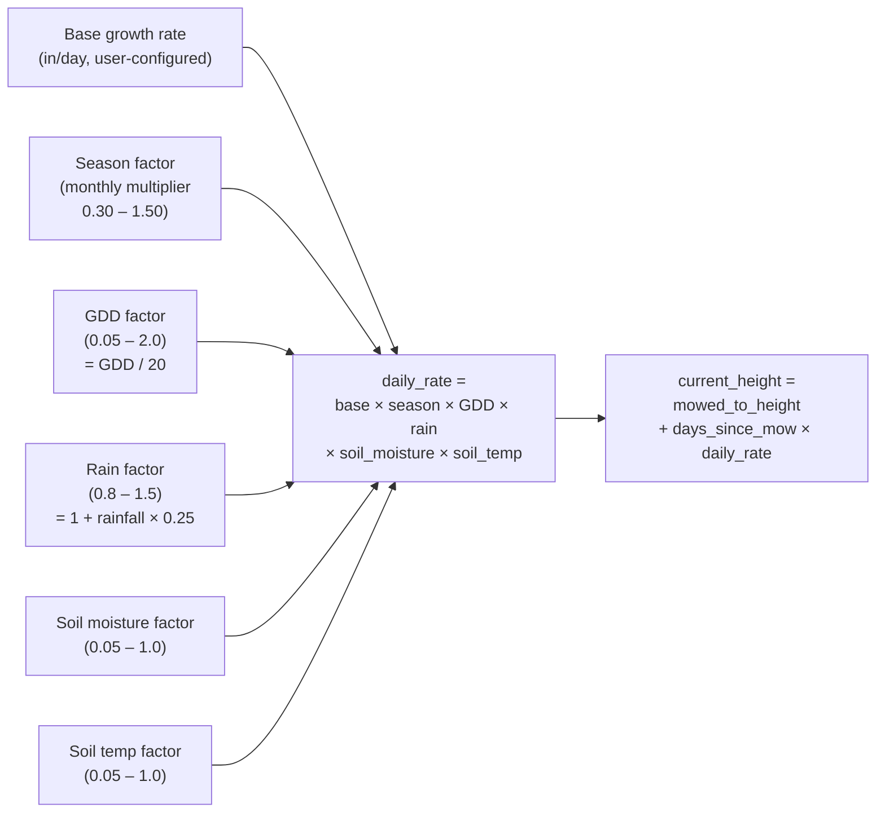

# Grass Growth Predictor — Architecture

→ [README](README.md) · [CHANGELOG](CHANGELOG.md)

## Table of Contents

- [Overview](#overview)
- [Entities](#entities)
  - [Sensors](#sensors)
  - [Binary Sensors](#binary-sensors)
  - [Switch](#switch)
  - [Buttons](#buttons)
- [Component Diagram](#component-diagram)
- [Data Flow](#data-flow)
- [Growth Model](#growth-model)
  - [Height Formula](#height-formula)
  - [Seasonal Factor](#seasonal-factor)
  - [GDD Factor](#gdd-factor)
  - [Rain Factor](#rain-factor)
  - [Soil Moisture Factor](#soil-moisture-factor)
  - [Soil Temperature Factor](#soil-temperature-factor)
- [Mow Scheduling Logic](#mow-scheduling-logic)
  - [grass\_wet](#binary_sensorgrassw_et)
  - [mow\_not\_advised](#binary_sensormownot_advised)
  - [dry\_mow\_window\_soon / next\_dry\_mow\_window](#binary_sensordry_mow_window_soon--sensornext_dry_mow_window)
  - [mow\_recommended](#binary_sensormow_recommended)
- [Update Intervals](#update-intervals)
- [Persistence](#persistence)
- [Configuration Options](#configuration-options)

---

## Overview

The integration estimates current grass height by accumulating a calculated daily growth rate over the time elapsed since the last mow. It is configured once via the UI config flow, runs a polling coordinator every **2 hours** to refresh data, and exposes **ten sensor entities**, **five binary sensors**, a **switch**, **two buttons**, and a `mark_mowed` service.

Weather data (GDD, rainfall, hourly humidity/precipitation) is read from a configured HA weather entity via `weather.get_forecasts` — no direct OWM API calls are made by this integration.

---

## Entities

### Sensors

| Entity | Unit | Description |
|---|---|---|
| `sensor.current_grass_height` | in | Estimated current grass height |
| `sensor.daily_growth_rate` | in/day | Fully computed daily growth rate (all active factors applied) |
| `sensor.days_since_last_mow` | d | Fractional days elapsed since the last mow |
| `sensor.growth_since_mow` | in | Grass growth above the mowed-to height since the last mow (compared against normal growth trigger and force-mow threshold) |
| `sensor.next_dry_mow_window` | timestamp | Start time of the next forecasted dry window long enough for a full mow cycle; `unknown` if none found in the lookahead period |
| `sensor.growing_degree_days` | °F·d | Today's GDD (avg temp − 50 °F base, floored at 0) |
| `sensor.rainfall` | in | Today's precipitation from OpenWeatherMap |
| `sensor.soil_moisture` | % | Volumetric soil moisture from National Soil Moisture Network |
| `sensor.soil_temperature` | °F | 2-inch soil temperature from the nearest USDA SCAN station |
| `sensor.season_factor` | *(dimensionless)* | Current month's seasonal growth multiplier (0.30 – 1.50) |

All sensors share the same **Grass Growth Predictor** device and update together on the 12-hour coordinator cycle.

### Binary Sensors

| Entity | Device class | Description |
|---|---|---|
| `binary_sensor.mow_recommended` | — | `ON` per wet-grass scheduling logic: always ON when overdue or force threshold exceeded; ON when normal trigger + dry; ON when normal trigger + wet + no dry window in lookahead |
| `binary_sensor.mow_overdue` | `problem` | `ON` when `days_since_mow ≥ max_days_between_mows` regardless of height or wet state |
| `binary_sensor.grass_wet` | `moisture` | `ON` when rainfall ≥ wet rain threshold OR current humidity ≥ wet humidity threshold |
| `binary_sensor.mow_not_advised` | — | `ON` when currently wet OR any hourly slot within `mow_cycle_duration_hours` hours fails the dry test (rain > 0.04 in, pop > 30%, or humidity ≥ threshold). Single go/no-go indicator for manual mowing. |
| `binary_sensor.dry_mow_window_soon` | — | `ON` when a contiguous dry window ≥ `mow_cycle_duration_hours` exists within the hourly forecast lookahead |

### Switch

| Entity | Description |
|---|---|
| `switch.mow_session_active` | Output that represents an in-progress mow session. Turn ON to dispatch/notify; turn OFF to cancel. State is persisted across restarts. |

### Buttons

| Entity | Description |
|---|---|
| `button.mark_mowed` | Records an ad-hoc manual mow; no session interaction. |
| `button.mow_complete` | Records a completed automated mow *and* turns off `switch.mow_session_active`. |

---

## Component Diagram



---

## Data Flow



---

## Growth Model



Each multiplier can be individually **enabled or disabled** via integration options. Disabled factors default to `1.0` (no effect).

### Height Formula

```
current_height = mowed_to_height + days_since_mow × daily_rate

daily_rate = base_rate
           × season_factor   (0.30 – 1.50, by month)
           × gdd_factor      (0.05 – 2.0,  GDD / 20)
           × rain_factor     (0.80 – 1.50, 1 + rainfall_in × 0.25)
           × soil_moisture   (0.05 – 1.0,  piecewise by %)
           × soil_temp       (0.00 – 1.0,  piecewise by °F)
```

---

### Seasonal Factor

Tuned for Northern Hemisphere cool-season turf (tall fescue, Kentucky bluegrass, perennial ryegrass). Peak growth in May; secondary flush in September as temperatures moderate.

| Month | Factor |
|---|---|
| January | 0.30 |
| February | 0.40 |
| March | 0.70 |
| April | 1.20 |
| May | 1.50 |
| June | 1.30 |
| July | 1.00 |
| August | 0.90 |
| September | 1.10 |
| October | 0.80 |
| November | 0.50 |
| December | 0.30 |

---

### GDD Factor

Growing Degree Days (GDD) measure heat accumulation above the base growth threshold for cool-season grasses (50 °F / 10 °C).

```
GDD       = max(0, (T_high + T_low) / 2 − 50 °F)
gdd_factor = clamp(GDD / 20.0, min=0.05, max=2.0)
```

The `OPTIMAL_GDD_DAILY` constant (20 °F·d) represents a typical high-growth day; at that value the factor is exactly `1.0`. Values above `1.0` accelerate growth up to `2.0×`; abnormally cold days floor at `0.05`.

| GDD (°F·d) | Factor |
|---|---|
| 0 | 0.05 |
| 5 | 0.25 |
| 10 | 0.50 |
| 20 | 1.00 |
| 30 | 1.50 |
| ≥ 40 | 2.00 (capped) |

---

### Rain Factor

Rainfall boosts the growth rate (well-watered conditions promote faster growth).

```
rain_factor = clamp(1.0 + rainfall_in × 0.25, min=0.80, max=1.50)
```

The floor of `0.80` is a safety net; since `rainfall_in ≥ 0`, the formula always produces `≥ 1.0` in practice.

| Rainfall today (in) | Factor |
|---|---|
| 0 | 1.00 |
| 0.5 | 1.13 |
| 1.0 | 1.25 |
| 2.0 | 1.50 (capped) |

---

### Soil Moisture Factor

Maps volumetric soil moisture percentage to a growth multiplier. Optimal range is 30–65%.

```
pct < 10          →  0.05                          (drought suppression)
10 ≤ pct < 30     →  0.05 + (pct − 10) / 20 × 0.95 (linear recovery)
30 ≤ pct ≤ 65     →  1.0                           (optimal)
65 < pct ≤ 85     →  1.0 − (pct − 65) / 20 × 0.35  (waterlogged, mild suppression)
pct > 85          →  0.65                           (saturated)
```

| Soil Moisture (%) | Factor |
|---|---|
| 0 | 0.05 |
| 10 | 0.05 |
| 20 | 0.52 |
| 30 | 1.00 |
| 65 | 1.00 |
| 75 | 0.82 |
| 85 | 0.65 |
| > 85 | 0.65 |

---

### Soil Temperature Factor

Maps 2-inch soil temperature (°F) to a growth multiplier calibrated for cool-season turf. Growth ceases at or below freezing.

```
temp ≤ 32         →  0.0                            (frozen)
32 < temp < 50    →  (temp − 32) / 18 × 0.25        (near-dormancy)
50 ≤ temp < 60    →  0.25 + (temp − 50) / 10 × 0.75 (green-up)
60 ≤ temp ≤ 75    →  1.0                            (optimal cool-season range)
75 < temp ≤ 95    →  1.0 − (temp − 75) / 20 × 0.55  (heat suppression)
temp > 95         →  0.45                           (peak heat stress)
```

| Soil Temp (°F) | Factor |
|---|---|
| 32 | 0.00 |
| 40 | 0.11 |
| 50 | 0.25 |
| 60 | 1.00 |
| 75 | 1.00 |
| 85 | 0.72 |
| 95 | 0.45 |
| > 95 | 0.45 |

---

## Mow Scheduling Logic

All scheduling binary sensors are recomputed on every coordinator poll (every 2 hours) from the latest hourly forecast and current state.

### `binary_sensor.grass_wet`

`ON` when **either** condition is true:

| Condition | Source | Configurable threshold |
|---|---|---|
| Today's accumulated rainfall ≥ threshold | Daily forecast `precipitation` field | `wet_rain_threshold_in` (default 0.1 in) |
| Current humidity ≥ threshold | Most recent hourly slot `humidity`; falls back to live weather entity `humidity` attribute if no hourly slots available | `wet_humidity_pct` (default 85%) |

---

### `binary_sensor.mow_not_advised`

Single go/no-go indicator for **manual mowing right now**.

`ON` when the grass is **currently wet** (see `grass_wet` above) **OR** any hourly forecast slot within the next `mow_cycle_duration_hours` hours fails the dry test:

| Per-slot criterion | Threshold |
|---|---|
| Rain per hour | > 0.04 in (~1 mm/h) |
| Precipitation probability | > 30% |
| Relative humidity | ≥ `wet_humidity_pct` |

The lookahead window is `ceil(mow_cycle_duration_hours)` slots — the same duration used to find a dry window. It answers: *if you start mowing now, will conditions stay tolerable long enough to finish a full cycle?*

---

### `binary_sensor.dry_mow_window_soon` / `sensor.next_dry_mow_window`

Scans up to `dry_window_lookahead_hours` of the hourly forecast for a contiguous block of dry slots that covers an entire mow cycle.

**Per-slot dry criteria** (all three must be satisfied):

| Criterion | Internal threshold | Configurable? |
|---|---|---|
| Rain per hour | ≤ 0.04 in (~1 mm/h) | No |
| Precipitation probability | ≤ 30% | No |
| Relative humidity | < `wet_humidity_pct` | Yes (default 85%) |

**Window duration check** — validated against real timestamps, not slot count:

```
window_duration = next_slot.dt − first_dry_slot.dt
                 (last slot uses its own dt + 3600 s as its end)
window is accepted when window_duration ≥ mow_cycle_duration_hours × 3600 s
```

This is correct regardless of the forecast interval (1-hour, 3-hour, etc.) provided by the configured weather entity.

`sensor.next_dry_mow_window` reports the `datetime` of the first qualifying slot.  
`binary_sensor.dry_mow_window_soon` is `ON` when any qualifying window was found.

---

### `binary_sensor.mow_recommended`

Four-condition OR gate. All thresholds are user-configurable via integration options.

```
mow_overdue    = days_since_mow ≥ max_days_between_mows
force_mow      = growth_since_mow ≥ force_mow_growth_threshold
days_ok        = days_since_mow ≥ min_days_between_mows
normal_trigger = days_ok AND growth_since_mow ≥ max_growth_between_mows

mow_recommended =
    mow_overdue                                         ← hard deadline — always fires
    OR force_mow                                        ← overgrown — always fires
    OR (normal_trigger AND NOT grass_wet)               ← ideal: grown enough and dry
    OR (normal_trigger AND grass_wet AND NOT dry_window_soon)
                                                        ← wet but no dry window coming
```

| Condition | Respects wet state? | Notes |
|---|---|---|
| `mow_overdue` | No | Hard upper day limit — mow regardless of conditions |
| `force_mow` | No | Overgrown — delay risks scalping; mow regardless |
| Normal trigger + dry | n/a | Preferred path |
| Normal trigger + wet + no window | — | Prevents indefinite postponement during prolonged wet weather |

---

## Update Intervals

| Data source | Fetch interval | Notes |
|---|---|---|
| HA weather entity (daily forecast: GDD + rainfall) | Every coordinator poll (2 h) | Reads from HA state via `weather.get_forecasts`. The weather entity manages its own OWM fetch schedule. |
| HA weather entity (hourly forecast: humidity + rain per hour) | Every coordinator poll (2 h) | Same call; used for wet-grass and mow-not-advised logic. |
| National Soil Moisture Network (soil moisture %) | 12 hours | In-memory cache only |
| USDA SCAN (2-inch soil temperature) | 12 hours | Station triplet resolved once, then cached in memory |
| Coordinator poll (height calculation + all sensor updates) | 2 hours | Wakes every 2 h; soil data only re-fetched when their TTL has elapsed |

---

## Persistence

| Key | What is stored |
|---|---|
| `last_mow_timestamp` | ISO timestamp of the most recent mow event |
| `mowed_to_height` | Height the grass was cut to (inches) |
| `mow_session_active` | Boolean — whether an automated mow session is in progress |

Weather data is no longer cached to HA storage; the HA weather entity handles its own caching.

All data is written to HA's built-in `.storage/` mechanism and survives restarts.

---

## Configuration Options

| Option | Description | Default |
|---|---|---|
| Latitude / Longitude | Location for soil API lookups | HA location |
| Weather entity | HA weather entity ID for daily + hourly forecast data | `weather.openweathermap` |
| Mowed to height | Starting height after a mow (in) | 3.0 in |
| Base growth rate | Daily growth rate ceiling (in/day) | 0.15 in/day |
| Enable seasonal | Apply monthly growth multiplier | ✓ |
| Enable GDD | Scale by growing degree days | ✓ |
| Enable rain | Scale by daily rainfall | ✓ |
| Enable soil moisture | Scale by volumetric soil moisture | ✓ |
| Enable soil temp | Scale by 2-inch soil temperature | ✓ |
| Minimum days between mows | Lower day bound — `mow_recommended` will not fire before this | 3 days |
| Maximum days between mows | Upper day bound — `mow_overdue` fires here regardless of height | 10 days |
| Normal growth trigger | Growth above mowed-to height (in) that triggers normal mow scheduling; dry window preferred | 0.5 in |
| Force-mow growth threshold | Growth above mowed-to height (in) that forces a mow regardless of wet conditions | 1.0 in |
| Mow cycle duration | How long the automated mower takes to complete one full cycle (hours) | 12.0 h |
| Wet rain threshold | Today's accumulated rainfall (in) above which grass is considered wet | 0.1 in |
| Wet humidity threshold | Current humidity (%) above which grass is considered wet from dew/overnight moisture | 85% |
| Dry window lookahead | Hours of hourly forecast to scan for a dry mow window; falls back to mowing anyway | 48 h |
